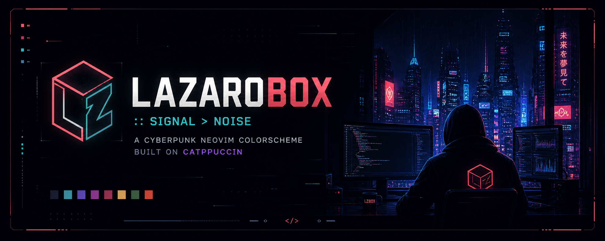
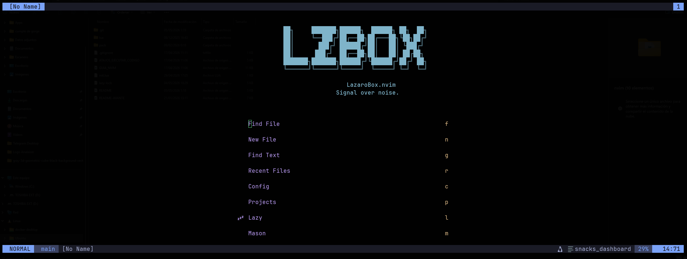

<

# 🟥 LazaroBox.nvim

```text
[ LZBOX ] :: signal > noise*Signal over noise.*
```

A cyberpunk-inspired Neovim colorscheme built on top of Catppuccin, designed for clarity, contrast, and long coding sessions.```

> ⚡ For the full experience, pair it with the official WezTerm config.

---

<p align="center">
    
</p>

---

## 🧠 Philosophy

> Prioritize signal. Suppress noise.

LazaroBox is not just a palette — it's a visual filtering layer for code.

- Reduced cognitive load via controlled contrast
- Semantic color grouping aligned with LSP scopes
- Minimal distractions, maximum readability
- Designed for long sessions in low-light environments

---

## 🎨 Palette

| Element    | Color     |
| ---------- | --------- |
| Background | `#191E28` |
| Surface    | `#1C212C` |
| Borders    | `#232A40` |
| Text       | `#F3F6F9` |
| Muted text | `#5C6170` |
| Cyan       | `#00FFFF` |
| Blue       | `#7FB4CA` |
| Purple     | `#B99BF2` |
| Mauve      | `#C99AD6` |
| Green      | `#B7CC85` |
| Yellow     | `#FFE066` |
| Gold       | `#E0C15A` |
| Red        | `#CB7C94` |
| Orange     | `#DEBA87` |

---

## 🧠 Concept

LazaroBox is built around a simple idea:

> Reduce noise. Highlight signal.

- Deep dark backgrounds
- Soft neon accents
- High contrast where it matters
- Minimal visual fatigue

Inspired by cyberpunk terminals and modern developer workflows.

---

## ⚙️ Installation

### Using lazy.nvim

````lua
{
  "pichu2707/lazarobox-nvim",
  name = "lazarobox",
  priority = 1000,
  config = function()
    require("catppuccin").setup({
      transparent_background = true,

      color_overrides = {
        all = {
          base = "#191E28",
          mantle = "#191E28",
          crust = "#232A40",

          text = "#F3F6F9",
          subtext0 = "#5C6170",
          subtext1 = "#00FFFF",

          blue = "#7FB4CA",
          mauve = "#C99AD6",
          pink = "#B99BF2",
          green = "#B7CC85",
          yellow = "#FFE066",
          rosewater = "#E0C15A",
          red = "#CB7C94",
          peach = "#DEBA87",
        },
      },
    })

    vim.cmd.colorscheme("catppuccin")
  end,
}

## Configuration
This theme is based on Catppuccin, using custom color overrides.

Example setupo:

```lua
require("catppuccin").setup({
  flavour = "mocha",
  transparent_background = true,

  color_overrides = {
    all = {
      base = "#191E28",
      mantle = "#191E28",
      crust = "#232A40",

      text = "#F3F6F9",
      subtext0 = "#5C6170",
      subtext1 = "#00FFFF",

      blue = "#7FB4CA",
      mauve = "#C99AD6",
      pink = "#B99BF2",
      green = "#B7CC85",
      yellow = "#FFE066",
      rosewater = "#E0C15A",
      red = "#CB7C94",
      peach = "#DEBA87",
    },
  },
})

vim.cmd.colorscheme("catppuccin")
````

## ⚡ Features

- Transparent background first-class support
- Tuned for Treesitter + LSP highlights
- Balanced saturation (no retina burn)
- Functional color semantics (not decorative)
- Compatible with modern plugin ecosystems

---

## 🧩 Ecosystem

LazaroBox is designed as part of a cohesive terminal experience.

### 🖥️ Neovim

- LazaroBox.nvim (this repository)
- Optimized for Treesitter, LSP and modern workflows

### 🟧 WezTerm

To fully experience the intended visual environment, use the matching WezTerm configuration:

👉 [https://github.com/pichu2707/lazarobox-wezterm](https://github.com/pichu2707/lazarobox-wezterm)

Includes:

- Matching color palette
- Transparency tuning
- Font and rendering optimizations
- Terminal-level contrast control

---

## 🔗 Recommended Setup

For best results:

- Neovim → LazaroBox.nvim
- Terminal → WezTerm config
- Background → Transparent compositor

## This combination ensures consistent color rendering across the entire stack.

## 🧬 Design Notes

- Background layers (`base`, `mantle`, `crust`) are flattened to reduce visual fragmentation
- Accent colors are scoped by syntax role (functions, types, constants, etc.)
- High-frequency elements (diagnostics, hints) use controlled emphasis
- No random color noise — every token has intent

---

## 🙏 Acknowledgements

Inspired by the work of **Gentleman-Programming**,  
especially the Kanagawa Blur aesthetic and terminal-driven workflows.

## 👤 Author

Built by Javi Lázaro
🌐 https://www.javilazaro.es

## 📜 License

MIT
